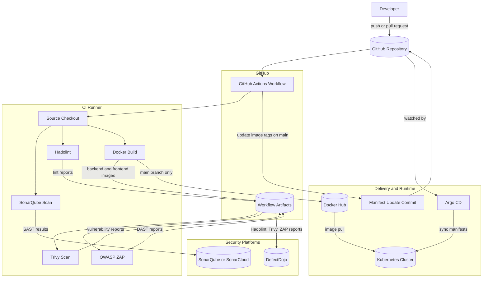

# Zero-Trust Private Kubernetes Cluster on AWS with Admin Gateway

## Overview

This Terraform project deploys a **fully automated, zero-trust Kubernetes cluster** in AWS with:
- **No SSH keys** - eliminated completely
- **No open port 22** - zero inbound network access
- **No bastion host** - cost-effective and secure
- **AWS SSM access only** - IAM-auditable terminal access
- **Dedicated Admin instance** - centralized kubectl gateway with pre-configured access
- **Network-enforced security** - Control plane API only accessible from Admin instance via security groups
- **Automated worker join** - workers join cluster automatically via SSM Parameter Store
- **CI/CD pipeline** - GitHub Actions with SonarQube, Hadolint, Trivy, OWASP ZAP, DefectDojo, and GitOps deployment
- **DefectDojo integration** - centralized security findings dashboard

## Architecture Design

### Zero-Trust Security Model
- All EC2 instances in **private subnets only** (no public IPs anywhere)
- **No internet-facing resources** (no bastion, no load balancers)
- **No inbound ports open** - not even SSH port 22
- **Admin instance as mandatory gateway** - only instance allowed to access Kubernetes API (port 6443)
- **Security group enforcement** - AWS firewall rules prevent any other instance from reaching control plane
- Access via **AWS Systems Manager (SSM)** with IAM authentication
- All access attempts logged in **CloudTrail** for auditing

### How It Works
1. **IAM Roles**: All EC2 instances have `AmazonSSMManagedInstanceCore` policy attached
2. **SSM Agent**: Pre-installed on Ubuntu AMI, establishes outbound-only connection to AWS
3. **Admin Gateway**: Dedicated private EC2 instance with kubectl pre-configured
4. **Security Groups**: Control plane only accepts port 6443 connections from Admin instance's security group
5. **Emergency Access**: Use `aws ssm start-session` for terminal access (no SSH needed)
6. **Daily Operations**: Connect to Admin instance via SSM, run kubectl commands directly
7. **Automated Join**: Control plane stores join command in SSM Parameter Store (base64 encoded), workers automatically retrieve and execute it

## Project Structure

```
.
├── main.tf                      # Module orchestration (purely module calls, no hardcoded logic)
├── providers.tf                 # AWS + null provider configuration
├── data.tf                      # Data sources (availability zones, AMI, account ID)
├── variables.tf                 # Root-level variable definitions
├── outputs.tf                   # Root-level outputs
├── upload-app.sh                # Called automatically by Terraform (also runnable manually)
├── modules/                     # Reusable modules
│   ├── vpc/                     # VPC, subnets, NAT, routing
│   │   ├── main.tf
│   │   ├── variables.tf
│   │   └── outputs.tf
│   ├── security/                # Security groups (admin + k8s nodes)
│   │   ├── main.tf
│   │   ├── variables.tf
│   │   └── outputs.tf
│   ├── s3/                      # S3 bucket for k8s-app delivery
│   │   ├── main.tf
│   │   ├── variables.tf
│   │   └── outputs.tf
│   ├── app-upload/              # Syncs k8s-app/ to S3 on every apply
│   │   ├── main.tf
│   │   ├── variables.tf
│   │   └── outputs.tf
│   ├── admin/                   # Admin kubectl gateway instance
│   │   ├── main.tf
│   │   ├── variables.tf
│   │   └── outputs.tf
│   └── compute/                 # K8s nodes with IAM roles for SSM
│       ├── main.tf
│       ├── variables.tf
│       └── outputs.tf
├── scripts/                     # Automation scripts (run via cloud-init)
│   ├── control-plane-setup.sh  # Auto-install K8s on control plane
│   ├── worker-setup.sh          # Auto-install K8s on workers
│   └── admin-setup.sh           # Auto-configure kubectl + download k8s-app from S3
├── k8s-app/                     # Application (synced to S3 on apply, deployed on admin)
│   ├── deploy.sh                # Deploy script (run on admin instance)
│   ├── backend/                 # Go REST API (multi-stage → ~20MB distroless)
│   │   ├── main.go
│   │   ├── go.mod
│   │   └── Dockerfile
│   ├── frontend/                # React SPA (4-stage → ~15MB nginx:alpine)
│   │   ├── src/
│   │   ├── index.html
│   │   ├── package.json
│   │   ├── vite.config.js
│   │   ├── nginx.conf
│   │   └── Dockerfile
│   └── k8s/                     # Kubernetes manifests
│       ├── 01-namespace.yaml
│       ├── 02-mongodb-hostpath.yaml
│       ├── 03-go-backend.yaml
│       ├── 04-react-frontend.yaml
│       └── 04-ingress.yaml
├── config/
│   └── terraform.tfvars        # Configuration values
├── .github/
│   └── workflows/
│       └── ci-cd.yml            # CI/CD pipeline (SonarQube + Hadolint + Trivy + ZAP + DefectDojo + GitOps)
├── defectdojo/
│   └── docker-compose.yml      # Self-hosted DefectDojo (security findings dashboard)
└── README.md                    # This file
```


## Configuration

Edit `config/terraform.tfvars` to customize. Variables are organized into logical groups:

**VPC Configuration:**
```hcl
vpc = {
  vpc_cidr            = "10.0.0.0/16"
  public_subnet_cidr  = "10.0.1.0/24"  # Used for NAT Gateway only
  private_subnet_cidr = "10.0.10.0/24"
}
```

**Compute Configuration:**
```hcl
compute = {
  control_plane_instance_type = "t3.medium"
  worker_instance_type        = "t3.medium"
  worker_count                = 2           
  control_plane_private_ip    = "10.0.10.100"
  control_plane_name          = "K8s-Control-Plane"
  worker_name                 = "K8s-Worker"
}
```

**Admin Instance Configuration:**
```hcl
admin = {
  instance_type = "t3.micro"
  admin_name    = "K8s-Admin"
}
```

**Note:** No SSH keys or bastion configuration needed!


## Usage

### Initialize Terraform

```bash
terraform init
```

### Plan the deployment

```bash
terraform plan -var-file="config/terraform.tfvars"
```

### Apply the configuration

```bash
terraform apply -var-file="config/terraform.tfvars"
```
### Destroy the infrastructure

```bash
terraform destroy -var-file="config/terraform.tfvars"
```

## Deploying the Application

The `k8s-app/` folder contains a **React + Go + MongoDB** stack demonstrating multi-stage Docker builds:
- **Go backend**: `golang:1.22-alpine` → `distroless/static-debian12` (~800MB → ~20MB)
- **React frontend**: `node:18` → `nginx:alpine` (~1.25GB → ~15MB) — 4-stage build
- **MongoDB**: `mongo:7.0` with hostPath persistence

Routing via nginx ingress: `/ → react-frontend:80`, `/api → go-backend:8080`

### Step 1 — Build and push Docker images (local machine, once)

```bash
# Go backend
docker build --platform linux/amd64 -t <YOUR_DOCKERHUB_USER>/go-backend:latest ./k8s-app/backend
docker push <YOUR_DOCKERHUB_USER>/go-backend:latest

# React frontend (multi-stage — builds through all 4 stages, final image is ~15MB)
docker build --platform linux/amd64 -t <YOUR_DOCKERHUB_USER>/node-frontend:latest ./k8s-app/frontend
docker push <YOUR_DOCKERHUB_USER>/node-frontend:latest
```

Then update the image names in the manifests:
- `k8s-app/k8s/03-go-backend.yaml` → `image: <YOUR_DOCKERHUB_USER>/go-backend:latest`
- `k8s-app/k8s/04-react-frontend.yaml` → `image: <YOUR_DOCKERHUB_USER>/node-frontend:latest`

#### Frontend multi-stage size comparison

The frontend Dockerfile has 4 named stages. Use `--target` to stop at any stage and compare sizes:

```bash
# Stage 3 — node:18 + node_modules + source + dist (~1.25 GB)
docker build --target builder    -t frontend:bloated   ./k8s-app/frontend

# Stage 4 — nginx:alpine + compiled dist only (~15 MB)
docker build --target production -t frontend:optimised ./k8s-app/frontend

docker images | grep frontend
```

### Step 2 — Apply infrastructure (S3 upload is automatic)

```bash
terraform apply -var-file="config/terraform.tfvars"
```

Terraform will:
1. Create all infrastructure (VPC, EC2, S3 bucket, IAM roles)
2. **Automatically upload `k8s-app/` to S3** via the `app-upload` module
3. Admin instance boots, downloads `k8s-app/` from S3, and configures kubectl

The upload re-triggers automatically on every `terraform apply` whenever any file inside `k8s-app/` changes — no manual steps needed.

> **If the admin instance is already running** (S3 was empty on first boot), re-sync manually:
> ```bash
> sudo su - ubuntu
> aws s3 sync s3://<BUCKET_NAME>/k8s-app/ ~/k8s-app/ --region us-east-1 --delete
> chmod +x ~/k8s-app/deploy.sh
> ```
> Get the bucket name with: `terraform output s3_bucket_name`

### Step 3 — Deploy on the admin instance

```bash
# Connect to admin instance
aws ssm start-session --target <ADMIN_INSTANCE_ID> --region us-east-1

# Switch to ubuntu (kubeconfig + k8s-app are here)
sudo su - ubuntu

# Deploy the full stack
cd ~/k8s-app && bash deploy.sh
```

`deploy.sh` installs the nginx ingress controller, applies all manifests, and waits for each component to become ready.

## Outputs

After applying, Terraform outputs:
- **Admin instance ID** (primary access point for kubectl)
- Control plane and worker instance IDs (for emergency troubleshooting)
- Private IPs of all instances
- SSM Session Manager commands
- Complete setup instructions
- Security architecture summary

## Prerequisites

1. **AWS CLI** installed locally: `aws --version`
2. **Terraform >= 1.3** installed: `terraform --version`
   - Providers used: `hashicorp/aws ~> 6.0`, `hashicorp/null ~> 3.0`
3. **Docker** installed locally (for building images): `docker --version`
4. **Session Manager Plugin** installed:
   - Instructions: https://docs.aws.amazon.com/systems-manager/latest/userguide/session-manager-working-with-install-plugin.html
5. **IAM Permissions** to use SSM:
   - `ssm:StartSession`
   - `ssm:TerminateSession`
   - `ec2:DescribeInstances`

## Access Pattern (Admin Gateway)

### Primary Access - kubectl via Admin Instance

**This is your main way to interact with the cluster:**

**Step 1:** Connect to Admin Instance via SSM
```bash
aws ssm start-session --target <ADMIN_INSTANCE_ID> --region us-east-1
```

**Step 2:** Switch to ubuntu user (kubeconfig pre-configured)
```bash
sudo su - ubuntu
```

**Step 3:** Run kubectl commands
```bash
kubectl get nodes
kubectl get pods -A
kubectl create deployment nginx --image=nginx
kubectl expose deployment nginx --port=80 --type=NodePort
kubectl get svc
```

**Why this approach?**
- kubectl already configured and ready to use
- kubeconfig automatically retrieved from Parameter Store during setup
- Network security enforced - only Admin instance can reach control plane API
- No port forwarding complexity
- No local kubeconfig management

### Emergency Terminal Access (Troubleshooting Only)

**Access Control Plane directly:**
```bash
aws ssm start-session --target <CONTROL_PLANE_INSTANCE_ID> --region us-east-1
```

**Monitor setup logs:**
```bash
sudo tail -f /var/log/k8s-setup.log
```

**Check cluster status:**
```bash
sudo kubectl get nodes
sudo kubectl get pods -A
```

**Access Worker Node directly:**
```bash
aws ssm start-session --target <WORKER_INSTANCE_ID> --region us-east-1
```

**Note:** Direct access to control plane/workers is for troubleshooting only. Normal operations should go through Admin instance.

## Kubernetes Setup

**Fully Automated Process (~10-15 minutes):**

**Control Plane (5-8 minutes):**
1. Kubernetes packages installed (kubeadm, kubelet, kubectl, containerd)
2. System configured (swap disabled, kernel modules, sysctl)
3. Control plane initialized with Calico CNI
4. kubectl configured for ubuntu user
5. Join command generated and stored in AWS SSM Parameter Store (base64 encoded)
6. Kubeconfig stored in AWS SSM Parameter Store (base64 encoded)

**Admin Instance (2-3 minutes):**
1. kubectl installed
2. Waits for kubeconfig to be available in Parameter Store
3. Retrieves and decodes kubeconfig
4. Configures kubectl for ubuntu, root, and ssm-user
5. Waits for control plane API to be fully ready
6. Tests connectivity and displays cluster status

**Workers (3-5 minutes):**
1. Kubernetes packages installed
2. System configured
3. **Automatically retrieve join command from SSM Parameter Store**
4. **Automatically join the cluster**

**What's Different from Traditional Setup:**
- No manual `kubeadm join` commands needed
- No copying join tokens between machines
- No SSH between control plane and workers
- No manual kubeconfig copying to admin instance
- Everything automated via AWS SSM Parameter Store with base64 encoding for data integrity

**Monitoring the automated setup:**

1. Connect to admin instance via SSM (recommended):
   ```bash
   aws ssm start-session --target <ADMIN_INSTANCE_ID> --region us-east-1
   ```

2. Watch the admin setup progress:
   ```bash
   sudo tail -f /var/log/admin-setup.log
   ```

3. Once complete, switch to ubuntu and use kubectl:
   ```bash
   sudo su - ubuntu
   kubectl get nodes
   kubectl get pods -A
   ```

4. Monitor control plane (if needed):
   ```bash
   aws ssm start-session --target <CONTROL_PLANE_ID> --region us-east-1
   sudo tail -f /var/log/k8s-setup.log
   ```

5. Monitor worker join progress:
   ```bash
   aws ssm start-session --target <WORKER_ID> --region us-east-1
   sudo tail -f /var/log/k8s-setup.log
   ```

## Architecture Benefits

### Security
- **Zero inbound ports** - not even SSH port 22 is open
- **No SSH keys to manage** - eliminates key rotation, storage, and compromise risks
- **IAM-based access control** - leverage AWS IAM for authentication and authorization
- **CloudTrail auditing** - all SSM sessions logged for compliance
- **TLS encrypted sessions** - SSM uses TLS 1.2+ with AWS managed certificates
- **Network-enforced access control** - Security groups prevent direct control plane access
- **Mandatory gateway pattern** - Admin instance is the only path to Kubernetes API
- **Defense in depth** - Multiple security layers (IAM + SSM + Security Groups + Private networking)

### Operational
- **No bastion maintenance** - no patching, no monitoring, minimal overhead
- **Simple kubectl workflow** - kubectl just works on admin instance, no port forwarding needed
- **Fully automated** - from infrastructure to cluster setup to worker join to admin configuration
- **Reproducible** - infrastructure as code with zero manual steps
- **Centralized management** - Single admin instance for all kubectl operations
- **Base64 encoding** - Prevents kubeconfig corruption during Parameter Store storage/retrieval

### Cost
- **Minimal overhead** - Only one t3.micro admin instance (~$7/month)
- **No bastion Elastic IP** - no charge for public IP (~$3.60/month savings vs traditional bastion)
- **Pay only for what you use** - SSM sessions cost nothing extra
- **Efficient design** - Admin instance also serves as troubleshooting gateway

## Security Architecture Deep Dive

### Network-Enforced Access Control

The admin gateway pattern enforces security at the **network layer** via AWS Security Groups:

**Admin Instance Security Group (`admin_sg`):**
```
Inbound:  NONE (access via SSM only)
Outbound: ALL (can reach internet, control plane API, SSM endpoints)
```

**Kubernetes Nodes Security Group (`k8s_nodes_sg`):**
```
Inbound:
  - Port 6443 (Kubernetes API) from admin_sg ONLY
  - All ports from self (inter-node communication)
Outbound: ALL
```

## CI/CD Pipeline

The project includes a **GitHub Actions pipeline** (`.github/workflows/ci-cd.yml`) that validates pull requests and, on pushes to `main`, publishes images and deploys through GitOps.

### CI/CD Architecture Diagram

The diagram below shows the main systems, integrations, artifacts, and deployment targets. The step-by-step job order is described in the pipeline flow section that follows.



### Pipeline Flow

- Pull requests run source analysis, Dockerfile linting, image builds, and Trivy vulnerability scanning.
- Pushes to `main` additionally publish SHA-tagged images to Docker Hub, run OWASP ZAP against the frontend container, upload supported scan reports to DefectDojo, and update Kubernetes manifests for Argo CD.

### Pipeline Jobs

| Step | Job | Tool | What it does |
|------|-----|------|--------------|
| 1 | **SonarQube SAST** | SonarQube | Scans Go + React source code for bugs, vulnerabilities, and code smells |
| 2 | **Hadolint Dockerfile Lint** | Hadolint | Lints the backend and frontend Dockerfiles and stores JSON reports as artifacts |
| 3 | **Docker Build** | Docker | Builds backend and frontend images and saves them as tar artifacts for downstream jobs |
| 4 | **Trivy Vulnerability Scan** | Trivy | Loads the built images and scans them for `CRITICAL`, `HIGH`, and `MEDIUM` vulnerabilities |
| 5 | **Docker Push** | Docker Hub | On pushes to `main`, publishes backend and frontend images with both the commit SHA and `latest` tags |
| 6 | **OWASP ZAP DAST** | OWASP ZAP | On pushes to `main`, runs a live baseline scan against the frontend container |
| 7 | **Upload to DefectDojo** | DefectDojo API | Imports available Hadolint, Trivy, and ZAP reports into the central findings dashboard |
| 8 | **Deploy (GitOps)** | Git + Argo CD | Commits SHA-pinned image tags to the manifests so Argo CD can sync the cluster |

**Note:** SonarQube findings stay in SonarQube/SonarCloud. The current workflow imports Hadolint, Trivy, and ZAP reports into DefectDojo.

### Required GitHub Secrets

Go to **Settings → Secrets and variables → Actions** in your GitHub repo:

| Secret | Description |
|--------|-------------|
| `SONAR_TOKEN` | SonarQube or SonarCloud authentication token |
| `SONAR_HOST_URL` | SonarQube base URL (for example `https://sonarcloud.io`) |
| `DOCKERHUB_USERNAME` | Your Docker Hub username |
| `DOCKERHUB_TOKEN` | Docker Hub access token ([create one here](https://hub.docker.com/settings/security)) |
| `DEFECTDOJO_URL` | DefectDojo base URL (e.g. `http://your-server:8080`) |
| `DEFECTDOJO_API_KEY` | DefectDojo API key (get from DefectDojo → API v2 Key) |

## DefectDojo Setup

DefectDojo is a self-hosted security findings dashboard that aggregates all scan results in one place.

### Start DefectDojo

```bash
docker compose -f defectdojo/docker-compose.yml up -d
```

Wait ~2 minutes for initialization, then access:
- **URL:** http://localhost:8080
- **Login:** `admin` / `admin` (change after first login)

### Get the API Key

1. Log in to DefectDojo
2. Navigate to **API v2 Key** (top-right user menu, or http://localhost:8080/api/key-v2)
3. Copy the token
4. Add it as `DEFECTDOJO_API_KEY` in your GitHub Secrets

### How Findings Appear

All scan results are uploaded under:
- **Product:** `k8s-app`
- **Engagement:** `CI/CD Pipeline`

Each pipeline run creates individual test entries:
- `Hadolint Backend - <commit SHA>`
- `Hadolint Frontend - <commit SHA>`
- `Trivy Backend Image - <commit SHA>`
- `Trivy Frontend Image - <commit SHA>`
- `OWASP ZAP DAST - <commit SHA>`

SonarQube analysis results remain available in SonarQube/SonarCloud rather than appearing as DefectDojo test entries.

### Stop DefectDojo

```bash
# Stop (preserves data)
docker compose -f defectdojo/docker-compose.yml down

# Full reset (deletes all data)
docker compose -f defectdojo/docker-compose.yml down -v
```


